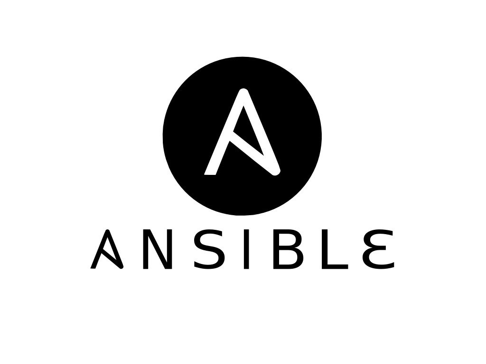
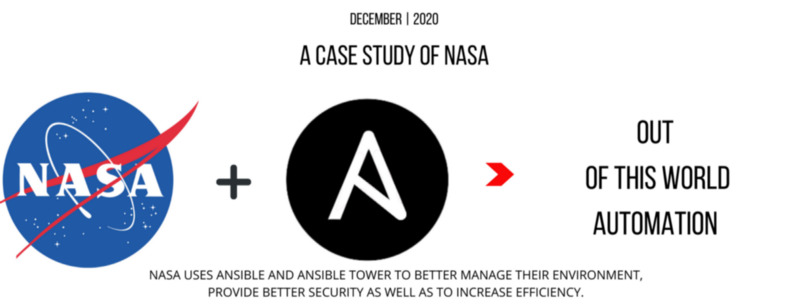

# ***Ansible Case Study ~ Helping in achieving complete IT Automation***

In today’s time every organization and business are growing on the basis of their ideas they deploy over the digital platforms, so delivering your application faster helps the organization to gain business previously that required a lot of manual effort and complicated coordination. But today, there is Ansible — the simple, yet powerful IT automation engine that thousands of companies are using to drive complexity out of their environments and accelerate DevOps initiatives.

Ansible seamlessly unites workflow orchestration with configuration management, provisioning, and application deployment in one easy-to-use and deploy platform. Regardless of where you start with Ansible, you’ll find this a simple, powerful and agentless automation platform that has the capabilities to solve your most challenging problems

### ***Lets understand what is Ansible ?***
Ansible is an open-source automation tool, or platform, used for IT tasks such as configuration management, application deployment, intraservice orchestration, and provisioning. Automation is crucial these days, with IT environments that are too complex and often need to scale too quickly for system administrators and developers to keep up if they have to do everything manually. Automation simplifies complex tasks, not just making developers’ jobs more manageable but allowing them to focus attention on other tasks that add value to an organization. In other words, it frees up time and increases efficiency.

## ***Let’s look at some of the reasons for Ansible’s popularity.***

### ***Advantages of Ansible***
♦ ***Free:*** Ansible is an open-source tool. Very simple to set up and use: No special coding skills are necessary to use Ansible’s playbooks (more on playbooks later).  
♦ ***Powerful:*** Ansible lets you model even highly complex IT workflows.  
♦ ***Flexible:*** You can orchestrate the entire application environment no matter where it’s deployed. You can also customize it based on your needs.  
♦ ***Agentless:*** You don’t need to install any other software or firewall ports on the client systems you want to automate. You also don’t have to set up a separate management structure.  
♦ ***Efficient:*** Because you don’t need to install any extra software, there’s more room for application resources on your server.  

Lets see with some real world use cases how ansible is actually helping the organizations with its powerful features and what kind of challenges it deals with.

### ***NASA Case Study***
***Business Challenges***

NASA’s initial focus was to move roughly 65 applications from a traditional hardware based data center in a rapid time-line to a cloud-based environment. The rapid time-line resulted in many applications being migrated ‘as-is’ to a cloud environment.

This allowed for NASA to gain significant cost savings from the change in infrastructure but did not allow for immediate cloud optimization of the applications and sites. As a result of the rapid migration requirement we had an environment spanning multiple virtual private clouds (VPCs) and AWS accounts that could not be easily managed. This resulted in scenarios where even simple things, like ensuring every system administrator had access to every server, or simple patching, were extremely burdensome.

***Solution***
In order to achieve better management as well as dealing with a diverse environment, a decision has been taken to go with ansible tower. using this the environment is in a very organized and scheduled way.

As a result of implementing Ansible they are better equipped to manage their environment. Ansible has allowed them to provide better operations and security to their clients.

✔ www.nasa.gov update window went from over 1 hour, to 5 minutes or less  
✔ Patching updates went from a multi-day process to a 45 minute process  
✔ Near real-time RAM and Disk monitoring accomplished without agents  
✔ OS Account provisioning across entire environment in less than 10 minutes  
✔ Baselining our standard AMI’s went from 1 hour of manual configuration to becoming an invisible background process  
✔ Application Stacks went from 1–2 hours to set up, to about 10 minutes per stack  

 
> ***“ As a result of implementing Ansible we are better equipped to manage our environment. Ansible has allowed us to provide better operations and security to our clients. It has also increased our efficiency as a team.” — Jonathan Davila DevOps Lead, InfoZen (InfoZen is the prime contractor for NASA which used ansible)***

### ***Conclusion***
Similarly there are many such organizations and business which ansible have supported.

### ***References***
1. https://www.ansible.com/blog/nasa-automation  
2. https://www.ansible.com/use-cases  
3. https://www.ansible.com/resources/case-studies  

## ***Thank You For Reading ……***
### ***Feel Free to Drop any kind of suggestions and queries they are always welcome : [Here](https://www.linkedin.com/in/gaurav-pagare-8b721a193/)***😊
